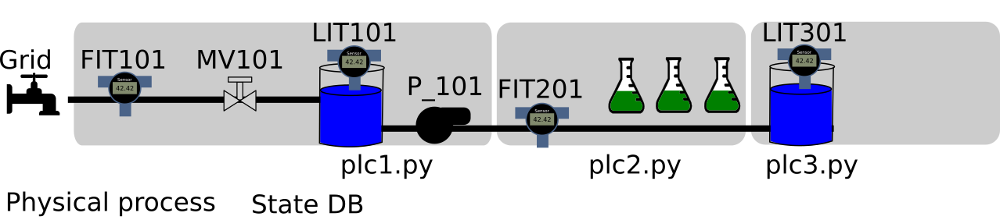
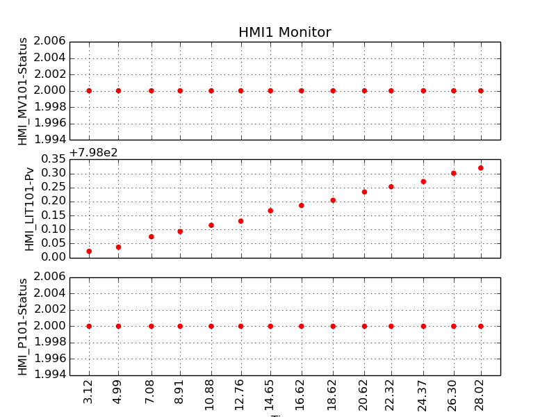

.. SWAT {{{1
.. _swat-tutorial:

*************
SWaT Tutorial
*************

This tutorial shows how to use MiniCPS to simulate a subprocess of a  
Water Treatment testbed. In particular, we demonstrate basic controls through
simulated PLCs, the network traffic, and simple physical layer simulation. We
now provide: 

* A brief system overview
* A list of the pre-requisites to run the tutorial
* Step-by-step instructions

.. SYSTEM OVERVIEW {{{2

=================
System Overview
=================

This tutorial is based on the *Secure Water
Treatment* (*SWaT*) testbed, which is used by Singapore
University of Technology and Design (SUTD)'s researcher and students in the
context of Cyber-Physical systems security research.

SWaT's subprocess are the followings:

P1: Supply and Storage
   Collect the raw water from the source

P2: Pre-treatment
   Chemically pre-treat the raw water

P3: UltraFiltration (UF) and Backwash
   Purify water and periodically clean the backwash filter

P4: De-Chlorination
   Chemically and/or physically remove excess Chlorine from water

P5: Reverse Osmosis (RO)
   Purify water, discard RO reject water

P6: Permeate transfer, cleaning and back-wash
   Storage of permeate (purified) water

.. SUPPLY AND STORAGE {{{3

Supply and Storage control
----------------------------

The simulation focuses on the first subprocess of the SWaT testbed.

As you can see from the figure, during normal
operating conditions the water flows into a Raw water tank (T101) passing through
an open motorized valve *MV101*. A flow level sensor *FIT101* monitors the
flow rate providing a measure in m^3/h.
The tank has a water level indicator *LIT101* providing a measure in
mm. A pump *P101* [#]_ is able to move the water to the next stage.
In our simulation we assume that the pump is either on or off and that its
flow rate is **constant** and can instantly change value.

The whole subprocess is controlled by three *PLCs (Programmable Logic Controllers)*.
*PLC1* takes the final decisions with the help of *PLC2* and *PLC3*. The
following is a schematic view of subprocess's control strategy:

* PLC1 will first:
   * Read LIT101
   * Compare LIT101 with well defined thresholds
   * Take a decision (e.g.: open P101 or close MV101)
   * Update its status

Then PLC1 has to communicate (using *EtherNet/IP*) with PLC2 and PLC3 that
are monitoring subprocess2 and subprocess3.

* PLC1 will then:
   * Ask to PLC2 FIT201's value
   * Compare FIT201 with well defined thresholds
   * Take a decision
   * Update its status
   * Ask to PLC3 LIT301's value
   * Compare LIT301 with well defined thresholds
   * Take a decision
   * Update its status

Notice that *asking to a PLC* is different from *reading from a sensor*,
indeed our simulation separate the two cases using different functions.

.. [#] The real system uses two redundant pumps, one is working and the other
       is in stand-by mode.

.. PREREQUISITES {{{2

=============
Prerequisites
=============

This tutorial assumes that the reader has a basic understanding of ``python
2.x``,  has familiarly with Linux OS, ``bash``, Mininet
and has a basic understanding of networking tools such
as: ``wireshark``, ``ifconfig`` and ``nmap``.

This tutorial will use the following conventions for command syntax:

``command``
   is typed inside a terminal (running ``bash``)

``mininet> command``
   is typed inside mininet CLI

``C-d``
   it means to press and hold ``Ctrl`` and then press ``d``.

It is important that you run the commands from the minicps root folder, you
can monitor your current working directory using:

.. code-block:: console

   pwd

And you should see something like ``../minicps``.

.. SWAT EXPLOTATION {{{2

=====================
SWaT's exploration
=====================

.. SWAT TOPOLOGY {{{3

SWaT topology
---------------

To start the simulation, open up a terminal, navigate into your ``minicps``
directory and type:
   
.. code-block:: console

   ./bin/swat-tutorial

Now you should see the ``mininet`` CLI:

.. code-block:: console

   mininet> 

Feel free to explore the network topology using ``mininet``'s built-in
commands such as: ``nodes``, ``dump``, ``net``, ``links`` etc.

At this time you should be able to answer questions such as:

* What is the IP address of PLC1?
* What are the (virtual) network interfaces?
* What is the network topology?

If you want to open a shell for a specific device, let's say ``plc1`` 
type:

.. code-block:: console

   mininet> xterm plc1

Now you can type any bash command from plc1 node, such that ``ping`` or
``ifconfig``.

At this time you should be able to answer questions such as:

* Are there web servers or ftp servers  running on some host ?
* Is the file system shared ?

You can exit mininet by pressing ``C-d`` or typing:

.. code-block:: console

   mininet> exit

You can optionally clean the OS environment typing:

.. code-block:: console

   sudo mn -c

.. CHANGING INITIAL VALUES {{{3

Changing initial values
-------------------------

Open ``examples/swat/state_db.py``,
to change LIT101 initial value select one line from the following:

.. literalinclude:: ../examples/swat/sub1/state_db.py
   :start-after: # SPHINX_SWAT_TUTORIAL SET LIT101DB
   :end-before:  # SPHINX_SWAT_TUTORIAL END SET LIT101DB

Open ``examples/swat/constants.py``,
to change process values set:

.. literalinclude:: ../examples/swat/constants.py
   :start-after: # SPHINX_SWAT_TUTORIAL SET PROCESS
   :end-before:  # SPHINX_SWAT_TUTORIAL END SET PROCESS

.. LOGS AND ERRORS {{{3

Logs and Errors
----------------------

``logs/swat.log`` keeps track of all logged information
appending them to the same file. 

``examples/swat/err`` is a folder that may
contains a ``component.err`` file for each component that during the *last*
simulation has written to ``stderr`` (e.g.: ``hmi.err``).

.. DUMB PLC1 {{{3

Dumb plc1
----------

Open ``examples/swat/tutorial/run.py``,
uncomment the line containing ``..ImageContainer.py...`` :

.. literalinclude:: ../examples/swat/tutorial/run.py
   :start-after: # SPHINX_SWAT_TUTORIAL SET POPUP
   :end-before:  # SPHINX_SWAT_TUTORIAL END SET POPUP

Run the simulation again... A window like the one below should pop-up (if you have an X server on your system):

The window contains three subplots: *HMI_MV101-Status*, *HMI_LIT101-Pv*
and *HMI_P101-Status*

HMI_MV101-Status and HMI_P101-Status are using the same encoding:

* ``2.00`` means OPEN/ON
* ``1.00`` means CLOSED/OFF
* ``0.00`` means ERROR

HMI_LIT101-Pv shows a graph of the last fifteen samples of the water level
from the tank in :math:`mm`.

IF you let the time pass you will notice that the flow will increase and the
MV101 and P101 status will remain the same. That is because by default the
tutorial launches a *dumb* PLC1 script. You can check
``examples/swat/plc1a.py`` to gain more insights.

You can stop the simulation typing:

.. code-block:: console

   mininet> C-d

And optionally clean the OS environment typing:

.. code-block:: console

   sudo mn -c

.. STD PLC1 {{{3

Standard plc1
-----------------

Open ``examples/swat/tutorial/run.py`` and comment/uncomment the relevant lines
to call the standard plc1 script:

.. literalinclude:: ../examples/swat/tutorial/run.py
   :start-after: # SPHINX_SWAT_TUTORIAL SET PLC1
   :end-before:  # SPHINX_SWAT_TUTORIAL END SET PLC1

Now start the simulation. You should see the same pop-up window like in
`Dumb plc1`_ but this time PLC1 will react according to the initial
conditions and the system thresholds.

If you have analyzed the services running on the mininet instance you
will have noticed a web server listening on ``192.160.1.100:80``. Try
to browse that IP within mininet during the simulation.

You can stop the simulation typing:

.. code-block:: console

   mininet> C-d

And optionally clean the OS environment typing:

.. code-block:: console

   sudo mn -c

.. POXSWAT SDN CONTROLLER {{{3

POXSwat SDN Controller
--------------------------

Open ``examples/swat/tutorial/run.py``, uncomment:

.. literalinclude:: ../examples/swat/tutorial/run.py
   :start-after: # SPHINX_SWAT_TUTORIAL SET SDN CONTROLLER
   :end-before:  # SPHINX_SWAT_TUTORIAL END SET SDN CONTROLLER

If you are familiar with SDN and the ``pox`` platform take a look at
``examples/swat/pox_controller.py``.
