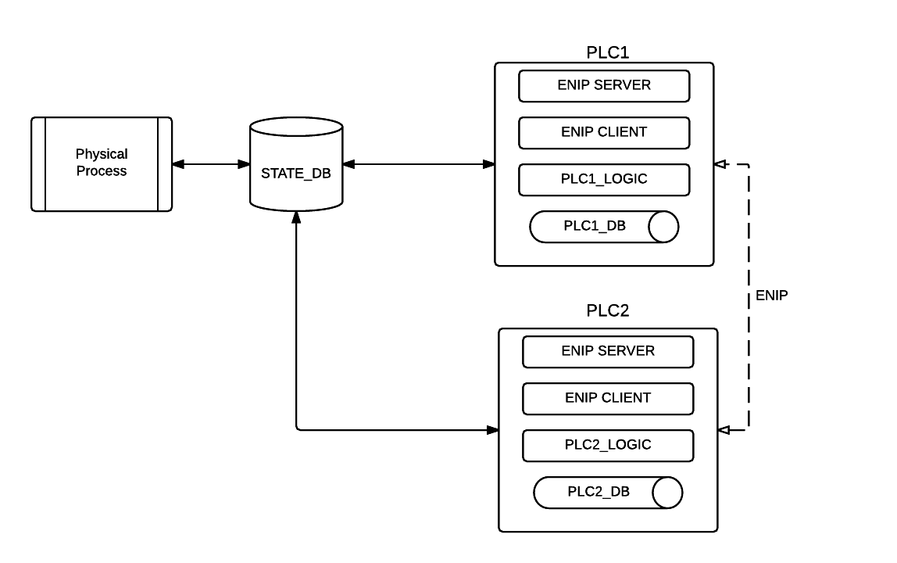

# MiniCPS Tutorial: SWaT #

## General view ##

* Each device is simulated in `mininet` as Linux container.
* Tags, sensors value and actuator values are modeled as DB records.
* Use `sqlite3` module from Python stdlib.

> TODO: use multiprocess or multi-threading from one process inside a
> container?

> TODO: use `multiprocesses`, `threading`, `pykka` or `gevent` ?

## State DB ##

    examples/swat/state_db.py

* schema
    * Tag table
        * text not null: SCOPE, NAME, DATATYPE
        * text: VALUE
        * integer: PID
        * PRIMARY KEY(SCOPE, NAME, PID)
    * PLC1 can access only subprocess1 records but can retrieve other records
      communicating directly with PLC2
    * filter in: INT, DINT, BOOL, REAL

* UDT
    * Currently relevant filed of UDT are modeled as single atomic tag. e.g.
      HMI_LIT301-Pv REAL value
    * Use `-` (dash) separation inside NAME field

Use sqlite `?` DB's API parameter substitution to to perform queries.

Tag names follows a naming scheme. SWaT store and update different version of
wireless and wired tag.

> TODO: maybe attack it

**Raw data tags** are in the form:

    [W_]XX_YYY_SNN_ZZZZ[_HTY]

* `W` is optional and denote *wireless* tags
* `XX` is the signal type: DO, DI, AI, AO
* `YYY` is the name of the device associated to the tag
* `S` is the subprocess number: 1, 2, ... , 6
* `NN` is the device number
* `ZZZZ` is a verb directly related to `YYY`
* `HTY` is a `BOOL` set by RIO to validate the integrity of data (omitted
  from simulation)
* e.g.: `W_AI_FIT_101_FLOW` is wireless flow indicator transmitter for subprocess1 number 1

**Public interface tags** are in the form:

    HMI_YYYSNN

* `TT_UDT` is the `DATATYPE` where `TT` is a convenient name to remember the
  User Defined Type
* e.g.: `HMI_MV101` with DATATYPE `MV_UDT`

`AI_FLOW_*` tags are indexed as `INT` datatype in the state db but their
value filed is interpreted as a `REAL`.

# CIP/ENIP #

## pycomm ##

* issues:
    * only CIP/ENIP subset client

## cpppo ##

* issues:
    * CIP/ENIP subset client/server
    * broken history module
    * `BOOL` tags are not supported
    * `SINT` (8-bit) tags are broken
    * use `INT` tags also for `BOOL` datatyps
    * heterogeneous array are not supported 
    * use list of atomic tags to represent PLC UDT

## Physical Process ##

* steps
    * list the required tags
    * init them in the PLC enip server
    * understands the interlock

### Subprocess 1 ###

## SWaT devices ##

### Historian ###

    examples/swat/histn.py

PLC init its http server and runs a infinite `while` loop.

### HMI ###

    examples/swat/hmi.py

PLC init its http server and runs a infinite `while` loop.

### PLC ###

    examples/swat/plcX.py

PLC init its cpppo enip server and runs a infinite `while` loop.

* schema
    * Tag
        * like state_db + timestamp
    * Use it like a cache
    * Re-use it for the Historian

* tag types:
    * user defined -> use Class
    * `program` accessible only by PLC_logic thread
    * `controller` accessible by all PLC threads

* tag attributes:
    * `Constant` writable only by RSLogix 5000 (default `True`)
    * `ExternalAccess` set permission for devices external to PLC (default `Read/Write`)
    * `RADIX` TODO

* logic
    * init the ENIP server db

## Simple example ##

> TODO: once ready move it as a sphinx tutorial doc

Simplifying assumptions:
* no UDT support: state_db and cpppo enip server will store relevant fileds
  of UDT
* state db will read raw data
* testbed in AUTO mode
* no alarms
* ignore PLC db.
* ignore wireless communications (and tags).
* assume that \_HTY tags are always True (ideal data generation)
* assume perfect communications btw PLCs and RIOs (no loss, neglibible delay)
* ignore PLC internal raw data computation

Start Minicps with a star topology with two PLCs, HMI, the state db `sdb` and the
physical process `ppr` hosts.
* `sdb` will run `state_db.py`.
* `ppr` will run `physical_process.py`
* `plc1` will run `plc1.py`
* `hmi` will run `hmi.py`
* `physical_process.py` will periodically read/write the state db
* `plc1.py` will periodically read/write the state db
* `hmi.py` will periodically query plc1 enip server thread and show
  results through a webserver interface

## Another example ##

Like Simple example but with:

* `plc1.py` will periodically read/write the state db tags regarding
  subprocess 1
* `plc2.py` will periodically read/write the state db tags regarding
  subprocess 2
* `plc1` enip client thread will ask to plc2 enip server thread for some value
* `plc2` enip server will send the value
* `plc1.py` will communicate with plc1 enip client thread and take a
  decision (write the state db)

## Future ##

* MVC model
* Crypto DB
* Implement read/write PLC access
* Model User Defined Tags as dedicated classes and import them into the DB
* Use Hystorian node 

| Threads/Procs |
| ------------- |
| xxxxxxxxxxx   |
| xxxxxxxxxxx   |
| xxxxxxxxxxx   |
| xxxxxxxxxxx   |

